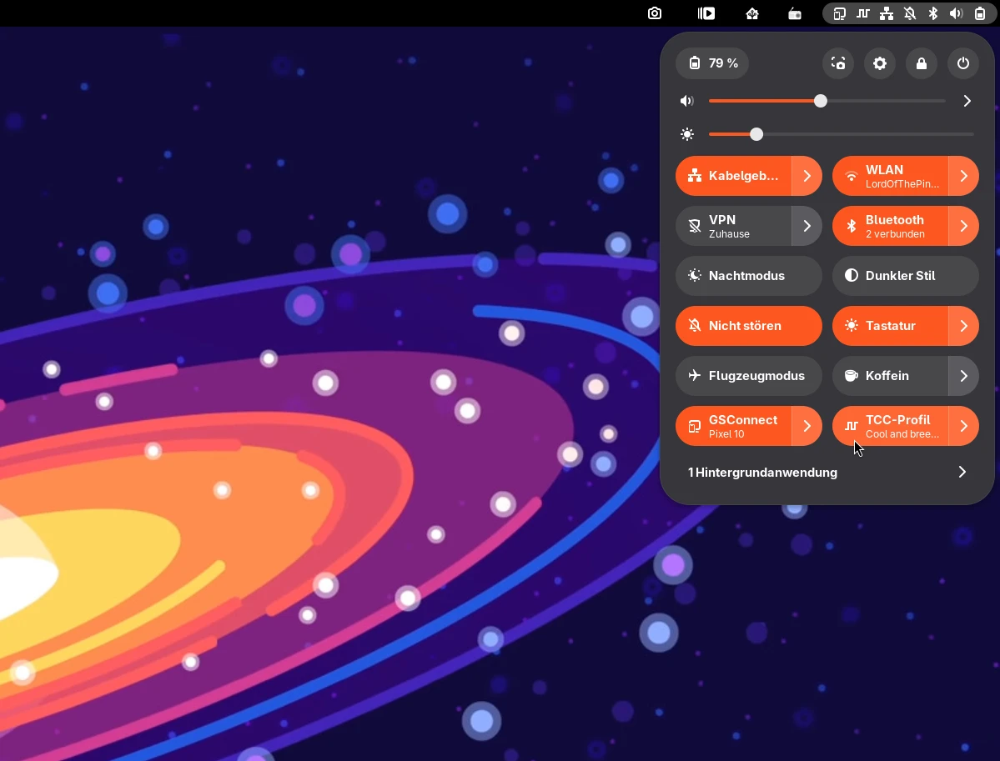
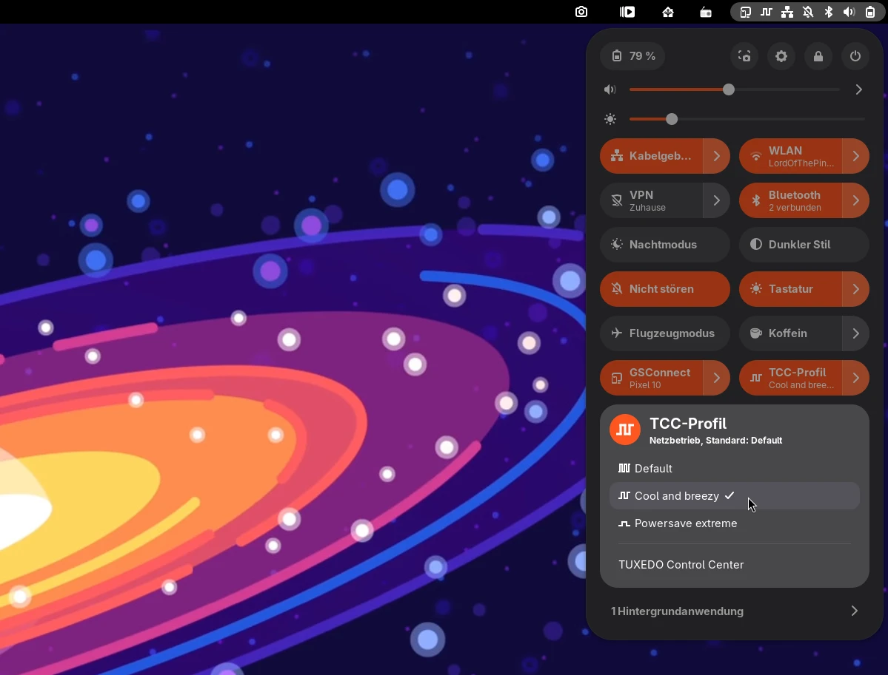

<p align="center">
  
</p>

# Pulsgeber

A GNOME Shell extension that switches the profiles of the
[TUXEDO Control Center](https://github.com/tuxedocomputers/tuxedo-control-center)
(TCC) from a toggle in the Quick Settings. For GNOME 50 and 51.

Unofficial, not affiliated with TUXEDO Computers.

<p align="center">
  
  
</p>

The German word *Pulsgeber* means pulse generator, the device that sets the
clock — a nod to CPU clock speeds, and to the profiles setting the pace of
the machine.

## Features

**Quick Settings toggle**

- A “TCC Profile” toggle showing the active profile as its subtitle, with all
  profiles in its menu.
- A profile picked from the menu lasts until the power source changes, just
  like in TCC's own tray menu. TCC's assignment of profiles to AC power and
  battery stays untouched.
- The toggle is on while a profile other than the one TCC assigns to the
  current power source is active. Clicking it switches back to that default
  profile, the next click to the last picked one — the same behaviour as
  GNOME's own power mode toggle.
- While a profile is picked by hand, the menu header says until when it lasts
  and what comes next, e.g. “Until on battery, then Cool and breezy”.
- Pulse icons per profile: one low pulse for power saving, two for balanced,
  three dense ones for performance. Optionally the icon also shows in the top
  bar while a non-default profile is active.
- Profiles created in TCC show up in the menu the next time it opens; their
  icon is guessed from their CPU and fan settings and can be pinned in the
  preferences. Settings of deleted profiles are cleaned up when the
  preferences open.

**Preferences**

- Quick Settings: top bar icon, “Don’t Start TCC Tray”, check interval.
- GNOME power mode: “Hide Power Mode Toggle” (on by default) and “Turn Off
  power-profiles-daemon”, see
  [TCC and power-profiles-daemon](#tcc-and-power-profiles-daemon).
- Profiles: show or hide each profile in the menu and pick its icon
  (automatic, performance, balanced, power saver). Default profiles can't be
  hidden.
- A link to the TUXEDO Control Center and an About dialog.

Available in English and German.

## Requirements

- GNOME 50 or 51.
- A running `tccd` (package `tuxedo-control-center`).

Pulsgeber talks to `tccd` over the system bus (`com.tuxedocomputers.tccd`) and
needs no root privileges. Since `tccd` sends no signal when the active profile
changes, Pulsgeber polls it (every 5 seconds by default).

## Do I need the TCC app?

No. Profiles are applied and enforced by the system service `tccd`, which the
package starts at boot as `tccd.service`; that is what Pulsgeber talks to. The
TUXEDO Control Center app and its tray icon (`tuxedo-control-center --tray`)
are just front ends to the same service. You only need the app to create and
edit profiles (`/etc/tcc/profiles`) and to assign them to AC power and
battery.

Besides its profile menu, the tray only tries to register the shortcut
Super+Alt+F6 (sent by the Control Center key on many TUXEDO keyboards), which
fails on GNOME under Wayland (“Failed to register global shortcut” in the
journal), restarts itself after an update, and nudges the display after
changes to the YCbCr 4:2:0 workaround — the latter with `xset`, which has no
effect on Wayland either.

The option “Don’t Start TCC Tray” does the same as “Tray autostart” in the
tray's own menu: it deletes
`~/.config/autostart/tuxedo-control-center-tray.desktop`, or copies it back
from the TCC installation. On top of that it ends or starts the running tray,
so the change applies right away. An open TCC window belongs to the same
process and closes as well.

That alone is not enough, though: every start of the TCC app creates a tray
icon too, and closing its window leaves the process running in the tray. So
while the option is on, Pulsgeber ends the TCC app a moment after its last
window closes, as if it had no tray. Electron swallows the first SIGTERM to
attempt a graceful shutdown, which TCC vetoes while its tray is up, so
Pulsgeber sends a second one after three seconds if the process is still
there.

## TCC and power-profiles-daemon

GNOME's power mode toggle belongs to power-profiles-daemon (ppd). ppd and
`tccd` don't complement each other, they write the same CPU settings
(governor and `energy_performance_preference`, on AMD also boost and minimum
frequency). `tccd` checks these values every 10 seconds and puts its profile
back as soon as they differ. A change in GNOME's toggle therefore only lasts a
few seconds, after which the toggle shows a mode that no longer applies. On an
InfinityBook S 17 Gen6 with intel_pstate: ppd sets EPP to `power`, about
5 seconds later it is back to `balance_performance` from the TCC profile.

TUXEDO OS doesn't ship ppd at all, and `tccd` doesn't know about it
([issue #422](https://github.com/tuxedocomputers/tuxedo-control-center/issues/422)).
So Pulsgeber hides GNOME's toggle by default while `tccd` is running. The
cleaner way is to turn ppd off entirely, under “GNOME Power Mode” → “Turn Off
power-profiles-daemon” in the preferences: Pulsgeber then masks and stops the
service through systemd's D-Bus API, and polkit asks once for the
administrator password. Switching back unmasks and starts it again. By hand,
that is:

```bash
sudo systemctl mask --now power-profiles-daemon.service
```

```bash
sudo systemctl unmask power-profiles-daemon.service && sudo systemctl start power-profiles-daemon.service
```

## Installing from source

```bash
git clone https://github.com/linuxundich/pulsgeber.git && cd pulsgeber && make install
```

On Wayland, GNOME Shell only picks up new extensions after logging in again,
then:

```bash
gnome-extensions enable pulsgeber@linuxundich.de
```

Other targets: `make zip` (package for extensions.gnome.org), `make pot`
(update the translation template and `po/de.po`), `make nested` (test in a
nested shell).

Tested on Arch Linux with GNOME Shell 50.5 and TUXEDO Control Center 3.0.10 on
a TUXEDO InfinityBook S 17 Gen6. GNOME 51 is declared but not tested yet.

## Layout

| File | Purpose |
|---|---|
| `extension/extension.js` | toggle, menu, top bar icon, hiding GNOME's power mode toggle |
| `extension/prefs.js` | preferences (libadwaita) and About dialog |
| `extension/tccd.js` | D-Bus access to `tccd`, icon guess per profile |
| `extension/ppd.js` | masking and unmasking power-profiles-daemon through systemd |
| `extension/tray.js` | autostart entry and process of the TCC tray |
| `build-aux/icons/generate_icons.py` | generates the app icon and the pulse icons; background in [docs/icon.md](docs/icon.md) (German) |
| `po/` | translations |

## Use of AI

Pulsgeber was developed with the help of AI. Most of the code, the icons, the
translations and the documentation were written by Claude (Anthropic) in
Claude Code, directed by me: I set the requirements, made the design
decisions (name, icon, behaviour), reviewed the results and tested the
extension on my own TUXEDO notebook. The research on how `tccd`,
power-profiles-daemon and the TCC tray interact was also done with AI
assistance and checked against the running system. Commits written with AI
assistance carry a `Co-Authored-By` line.

## Versions

The version lives in `version-name` in `extension/metadata.json`; every
release is tagged `vX.Y.Z` in Git. Changes are listed in the
[CHANGELOG](CHANGELOG.md).

## License

GPL-3.0-or-later
