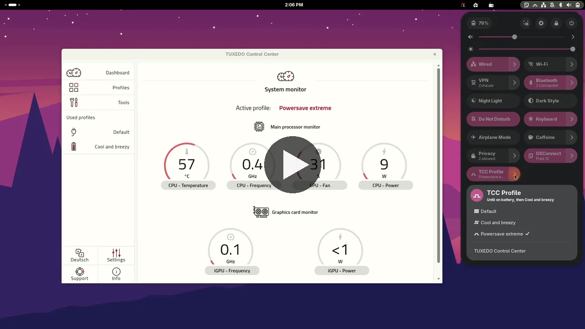
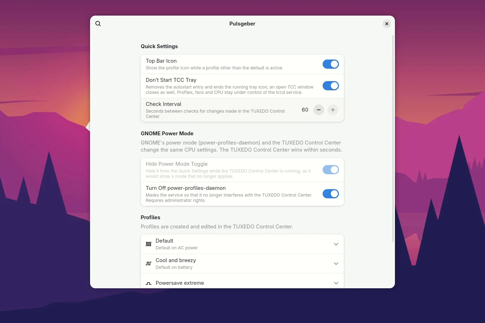
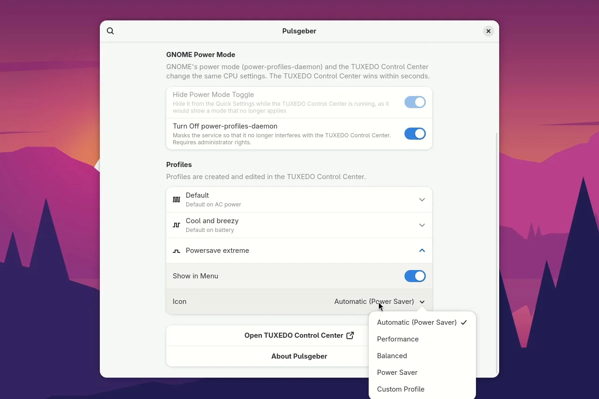

<p align="center">
  
</p>

<h1 align="center">Pulsgeber</h1>

<p align="center"><strong>Your TUXEDO power profiles, one click away in GNOME.</strong></p>

<p align="center">
  A GNOME Shell extension that puts the profiles of the TUXEDO Control Center into the Quick Settings,
  right where GNOME shows its power modes. Quiet on battery, full power at the desk, without opening the Control Center.
</p>

<p align="center">
  <a href="https://github.com/linuxundich/pulsgeber/releases/latest"><strong>Download ZIP</strong></a>
  &nbsp;·&nbsp; GNOME Extensions: planned &nbsp;·&nbsp;
  <a href="https://linuxundich.de/en/projects/pulsgeber/">Project page</a>
  &nbsp;·&nbsp;
  <a href="CHANGELOG.md">Changelog</a>
</p>

<p align="center">
  
</p>

## See it in action

<a href="docs/pulsgeber-demo.mp4"></a>

Switch profiles from the Quick Settings, see the Control Center follow along,
let the top bar show the active profile and set everything up in the
preferences.

[**Watch the 75-second demo**](docs/pulsgeber-demo.mp4) (MP4, 3 MB)

<br clear="right"/>

## What it does

### One toggle for all your profiles

A "TCC Profile" toggle in the Quick Settings shows the active profile, and its
menu lists every profile from the TUXEDO Control Center. Click the toggle to
switch between the default profile and the one you picked last, just like
GNOME's own power mode.

### AC power and battery at a glance

A profile you pick lasts until you plug in or unplug. The menu tells you what
comes next, for example "Until on battery, then Cool and breezy". The Control
Center shows every switch right away.

<p align="center">
  
</p>

### Icons that show the pace

One pulse for power saving, two for balanced, three for performance, and a
pulse above a slider for profiles you created yourself. If you like, the top
bar shows the icon while a non-default profile is active.

### Made to fit in

Pulsgeber hides GNOME's power mode toggle, which would only fight with the
Control Center, and can turn off power-profiles-daemon for good. It can also
keep the Control Center tray from starting; the menu entry
"TUXEDO Control Center" opens the app whenever you need it.

<p align="center">
  
  
</p>

### Your menu, your choice

In the preferences you decide which profiles appear in the menu and which icon
each one gets. Pulsgeber speaks English and German and follows the language
of your desktop.

## Install

> [!NOTE]
> A release on extensions.gnome.org is planned. For now, install the ZIP package from the Releases page.

Pulsgeber needs GNOME 50 or 51 and the TUXEDO Control Center with its service
`tccd` (package `tuxedo-control-center`, included in TUXEDO OS).

1. Download `pulsgeber@linuxundich.de.shell-extension.zip` from the [latest release](https://github.com/linuxundich/pulsgeber/releases/latest).
2. Install it:

```sh
gnome-extensions install pulsgeber@linuxundich.de.shell-extension.zip
```

3. Log out and back in, then enable it:

```sh
gnome-extensions enable pulsgeber@linuxundich.de
```

## Questions

**Do I still need the TUXEDO Control Center app?**
Only to create and edit profiles and to assign them to AC power and battery.
The profiles are applied by the system service `tccd`, and that is what
Pulsgeber talks to.

**Why does GNOME's power mode toggle disappear?**
power-profiles-daemon and `tccd` write the same processor settings, and `tccd`
puts its profile back within seconds. A change in GNOME's toggle would only
last a moment, so Pulsgeber hides it.

**Does it work without a TUXEDO notebook?**
No. Without `tccd` there are no profiles to switch.

**Is Pulsgeber a TUXEDO product?**
No. It is an unofficial project, not affiliated with TUXEDO Computers.

## On the blog

Pulsgeber has its own page on my blog
[Linux und Ich](https://linuxundich.de/en/projects/pulsgeber/), with more
details on the extension and news about upcoming versions. The
[project overview](https://linuxundich.de/en/projects/) lists everything else
I build for the Linux desktop. Questions, ideas or feedback that don't fit
into an issue? [Get in touch](https://linuxundich.de/en/contact/), I read
every message.

## More

- [Project page on linuxundich.de](https://linuxundich.de/en/projects/pulsgeber/): details, background and news
- [Technical notes](docs/TECHNICAL.md): `tccd`, the TCC tray, power-profiles-daemon, building from source
- [Changelog](CHANGELOG.md)
- Found a bug or want to translate Pulsgeber? [Open an issue](https://github.com/linuxundich/pulsgeber/issues) or add a po file in [po/](po/)

The German word *Pulsgeber* means pulse generator, the device that sets the
clock: a nod to CPU clock speeds, and to the profiles setting the pace of the
machine.

## Use of AI

Pulsgeber is AI-assisted. Most of the code, the icons, the translations and
the documentation were written with AI assistance, directed by me: I set the
requirements, made the design decisions (name, icon, behaviour), reviewed the
results and tested the extension on my own TUXEDO notebook. Commits written
with AI assistance carry a `Co-Authored-By` line.

## License

Pulsgeber is free software under the [GPL-3.0-or-later](LICENSE). It is a
personal project, tested on a TUXEDO InfinityBook S 17 Gen6 with GNOME 50.5.
