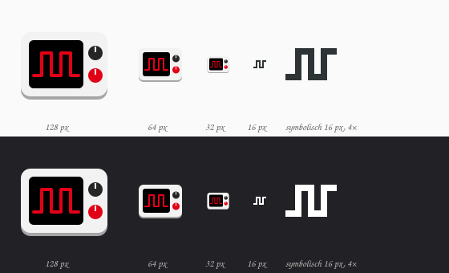

# Pulsgeber

GNOME-Shell-Erweiterung, die die Profile des [TUXEDO Control Centers](https://github.com/tuxedocomputers/tuxedo-control-center) über eine Pille in den Schnelleinstellungen umschaltet. Für GNOME 50 und 51.

Inoffiziell, keine Verbindung zu TUXEDO Computers.



## Funktionen

- Pille „TCC-Profil“ mit dem aktiven Profil als Untertitel und allen Profilen im Menü.
- Die Pille ist eingeschaltet, solange ein anderes Profil läuft als das, das TCC der aktuellen Stromquelle (Netz oder Akku) zuordnet. Ein Klick schaltet zurück auf dieses Standardprofil, der nächste wieder auf das zuletzt gewählte.
- Der Wechsel gilt wie im Tray-Menü von TCC nur bis zum nächsten Wechsel der Stromquelle, die Zuordnung in TCC bleibt unverändert.
- Optional ein Symbol in der oberen Leiste, solange ein abweichendes Profil aktiv ist.
- Eigene Puls-Symbole je Profil: ein flacher Puls für Energiesparen, zwei für Ausgeglichen, drei dichte für Leistung.
- Blendet GNOMEs eigenen Schalter „Energiemodus“ aus, solange `tccd` läuft (abschaltbar, siehe unten).
- Einstellungen: Profile im Menü ausblenden, Symbol je Profil (Leistung, Ausgeglichen, Energiesparmodus oder automatisch geraten), Prüfintervall.

## Voraussetzungen

Ein laufender `tccd` (Paket `tuxedo-control-center`). Die Erweiterung spricht ihn über den System-Bus an (`com.tuxedocomputers.tccd`), Root-Rechte braucht sie nicht. Weil `tccd` Profilwechsel nicht meldet, fragt sie das aktive Profil regelmäßig ab (Standard: alle 5 Sekunden).

## TCC und power-profiles-daemon

GNOMEs Schalter „Energiemodus“ gehört zum power-profiles-daemon (ppd). ppd und `tccd` ergänzen sich nicht, sie schreiben dieselben CPU-Einstellungen (Governor und `energy_performance_preference`, auf AMD auch Boost und Mindesttakt). `tccd` prüft diese Werte alle 10 Sekunden und schreibt sein Profil zurück, sobald sie abweichen. Ein Wechsel im GNOME-Schalter wirkt deshalb nur wenige Sekunden, danach zeigt der Schalter einen Modus an, der nicht mehr gilt. Auf einem InfinityBook mit intel_pstate: ppd setzt EPP `power`, nach rund 5 Sekunden steht wieder `balance_performance` aus dem TCC-Profil.

TUXEDO OS liefert ppd gar nicht erst aus, und `tccd` kennt ppd nicht ([Issue #422](https://github.com/tuxedocomputers/tuxedo-control-center/issues/422)). Pulsgeber blendet den GNOME-Schalter deshalb standardmäßig aus, solange `tccd` läuft. Sauberer ist es, ppd ganz abzuschalten:

```bash
sudo systemctl mask --now power-profiles-daemon.service
```

## Installation aus dem Quellcode

```bash
make install
```

Unter Wayland lädt GNOME Shell neue Erweiterungen erst nach dem nächsten Anmelden, danach:

```bash
gnome-extensions enable pulsgeber@linuxundich.de
```

Weitere Ziele: `make zip` (Paket für extensions.gnome.org), `make pot` (Übersetzungsvorlage aktualisieren), `make nested` (Test in einer verschachtelten Shell).

## Lizenz

GPL-3.0-or-later
